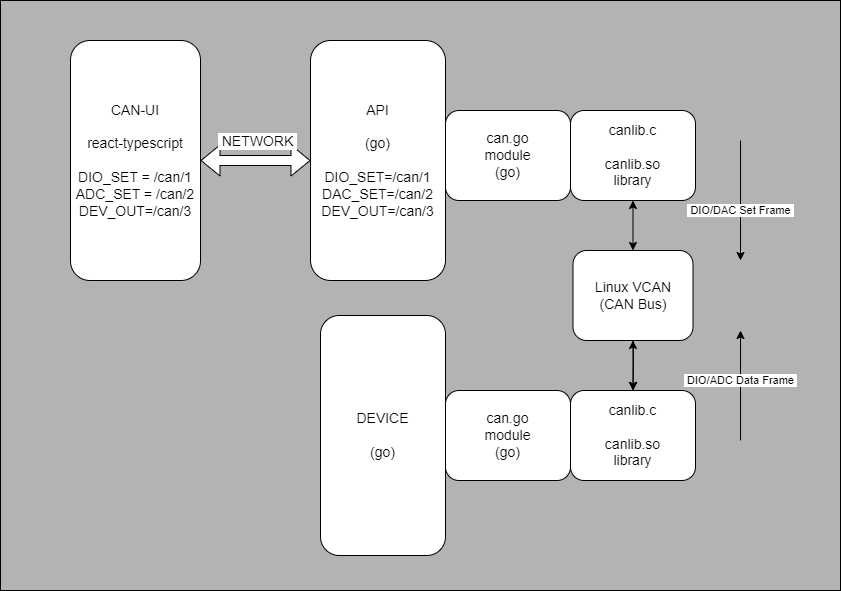

# SIMPLE CAN BUS WITH GO

This project is a collection of Go and C libraries and programs that set up a very simple simulation of a set of devices. It might be useful for someone experimenting with CAN bus with Go for the first time.

## References

The primary sources I used for figuring out CAN and vcan.

https://netmodule-linux.readthedocs.io/en/latest/howto/can.html
https://github.com/linux-can/can-utils
https://docs.kernel.org/networking/can.html
https://elinux.org/CAN_Bus
https://www.pragmaticlinux.com/2021/10/how-to-create-a-virtual-can-interface-on-linux/

## CAN Bus

The Controller Area Network (CAN) bus provides a sort of publish/subscribe model on an electrical bus. Nodes connect to the bus and send (publish) and/or receive (subscribe). CAN is all about messages, not endpoints. A sender (publisher) does not need to know an address for the receive (subscribe) endpoint. There may be not an endpoint listenting for a particular message.

A few things about CAN:

- CAN messages have an ID, length (1-8 bytes) and data
- any number of 'subscribers' can listen for any number of messages with specified ID's.
- subscribers don't care who sent the message. They only care about the ID and data.
- a given message ID can only be sent by a one 'publisher'
- it is not allowed for multiple publishers to send the same message ID
- this architecture makes it relatively simple to compose a set of sensors, actuators and computers without having to specify a network graph.

## Linux VCAN

## A Simple CAN Bus Example

Linux has a standard module called vcan (virtual CAN bus) that can be used to model a pphysical system. See the references above for details.

This doc shows how to string together a few software modules and the VCAN device to illustrate using CAN bus in as simple a way as possible.

The architecture looks something like this:



Starting at the bottom of the diagram and going counter-clockwise:

- ./device/device.go : simple simulated device accessible over CAN
  - ./g/can.go module
  - ./c/canlib.c (libcan.so)
- VCAN - Linux standard CAN bus simulator
  - ./c/canlib.c (libcan.so)
  - ./g/can.go (module)
- ./api/api.go
  - web api
- ./can-ui/src/App.tsx

The CAN bus messages include:

- 1 : ID_DIO_SET : the simulated device listens for this message to set a digital IO register.
- 2 : ID_DIO_OUT : the simulated device sends data from a digital IO register at 10 Hz. Applications can listen for this message to get updates.
- 3 : ID_DAC_SET : the simulated device listens for this message to set a digital-to-analog input.
- 4 : ID_ADC_OUT : the simulated devices sends data from an analog-to-digital device at 10 hz.

## Dependencies

- Linux package 'build-essential;
- node.js

This document assumes a Debian type system, such as Ubuntu. Some operations may be different on a Fedora based system.

Here are the steps to get this built and running:

## Step 1 : Activate the VCAN IP Device

- this step attempts to load the VCAN kernel module
- https://www.pragmaticlinux.com/2021/10/how-to-create-a-virtual-can-interface-on-linux/
- If the modprobe fails to find vcan, then your kernel probably doesn't have CAN support built in so you would have to build a kernel. That's not trivial but its dooable.

```bash
    #!/bin/bash
    # Load the kernel module.
    sudo modprobe vcan
    # Create the virtual CAN interface.
    sudo ip link add dev vcan0 type vcan
    # Bring the virtual CAN interface online.
    sudo ip link set up vcan0
```

## Step 2 : Install Linux CAN Utils

https://github.com/linux-can/can-utils

The standard package 'can-utils' includes a bunch of utilities for working with CAN bus on Linux. Using candump or cansend is a good way to test the complement functions in the c or go versions.

```bash

# INSTALL
sudo apt install can-utils

# TEST
# terminal 1
candump -tz vcan0

# terminal 2
cansend vcan0 123#00FFAA5501020304
```

## Step 3 : Review the Source Directories

Refer to the block diagram for the usage and location of the various components.

<hr/>

The first two directories, ./c and ./g build the infrastructure required to use Go to access a CAN bus device. In this case the VCAN simulated device. But it would apply to any conventional CAN device.

## ./c/canlib.c

**See ./c/README.md**

Directory 'c' contains a set of stripped down functions that can be used to send and receive data from a CAN bus interface. The code here has the more complicated incantations to connect to a CAN device using the socket interface. This is based on excerpts from https://github.com/linux-can/can-utils

The Makefile builds libcan.so. It has an option to load it to /usr/local/lib which requires sudo permission. Just remove the comments in the libcan.so rules. If you prefer to just keep it local, no change is needed.

Two test programs can_test_receive.c and can_test_send.c exercise the interface.

## ./g/can.go

**See ./g/README.md**

Directory 'g' provides a Go module with functions that use the C libcan.so to interface to a CAN bus interface. This module sends and receives **raw CAN frames**. This directory also contains unit tests. The code here intends to be a very simple wrapper over the C library. This provides basic CAN send/receive support for Go. A real CAN device may have more functionality like error handling and filtering incoming messages. Setting that up would depend on the specific device.

The Makefile compiles the module.

<hr/>

## ./device/device.go

**See ./device/README.md**

Directory ./device implements a program that simulates a CAN sensor unit. It reads CAN messages from a client program, parses them and sends formattted simulated sensor data to the can bus. Think of this program as the microcomputer sensor sitting in the hardware.

The Makefile compiles to an executable.

Test functions are included using the Go test framework.

 <hr/>

The next directories implement the application components needed to implement the example system shown in the diagram.

## ./client/client.go

**See ./client/README.md**

Directory ./client provides a Go API accessible by other Go programs to communicate with the 'device' over the CAN bus. The 'client' is not directly connected to the 'device'. All communication between the two is over the CAN bus. The client implements the specified set of inputs and outputs that the device provides. Think of this program as the application 'backend' that sits in some computer in the system.

## ./api/api.go

**See ./api/README.md**

Directory "api" contains a web backend that connects to the 'client' program. It provides send/receive functions for a web application that displays and controls the CAN simulation.

## ./ui

**See ./can-ui/README.md**

A web client UI for accessing the CAN bus data.

## Step 4 : Build the System

The top level Makefile will build all the system components and run the relevant tests. Just execute 'make' at the top level to build.

It builds in this order:

- ./c/Makefile
- ./g/Makefile
- ./device/Makefile
- ./api/Makefile
- ./ui/Makefile

The Makefile also includes a 'clean' step.

## Step 5 : Run the System

To run the components in separate terminals:

- in a terminal, execute ./device/device
- in a terminal, execute ./api/api
- in a terminal, execute can-ui (must be in ./ui directory)

```bash
# first terminal
cd device && ./device

# second terminal
cd api && ./api

# third terminal
cd ui && ./can-ui
```
