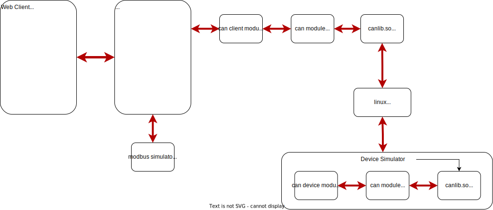

# SQIRVY

This project is a collection of programs that implement a simulation of a set of devices. It includes a CAN bus simulation app.

## References

The primary sources I used for figuring out CAN and vcan.

https://github.com/linux-can/can-utils
https://docs.kernel.org/networking/can.html
https://elinux.org/CAN_Bus
https://www.pragmaticlinux.com/2021/10/how-to-create-a-virtual-can-interface-on-linux/

## CAN BUS SIMULATION

The architecture looks something like this:



The CAN bus simulator uses the Linux 'vcan' support, along with a simple 'device' that is accessible over the CAN bus. It listens for CAN frames from a controller and responds with data.
There is a controller that consists of a web app front end, through an API endpoint that connects to the can bus and forwards commands and returns response data from the 'device'.

The CAN bus messages include:

- 1 : ID_DIO_IN : the simulated device listens for this message to set a digital IO register.
- 2 : ID_DIO_OUT : the simulated device sends data from a digital IO register at 10 Hz. Applications can listen for this message to get updates.
- 3 : ID_DAC_IN : the simulated device listens for this message to set a digital-to-analog input.
- 4 : ID_ADC_OUT : the simulated devices sends data from an analog-to-digital device at 10 hz.

### How To Run

- Install vcan support on Linux if its not already there. I used Ubuntu 20 which has the support. The instructions here are for debian based systems.
- Install build-essential, golang (18 or later) and nodejs.
- Activate the VCAN module for use as a network device (see below)
- Clone this repo at https://github.com/dmh2000/sqirvy (pronounced 'scurvy')
- cd into top level
- execute 'make'
  - the make process will install a new shared library into /usr/local/lib. The makefile will ask for 'sudo' privileges.
- in a terminal, run the vcan/device/device program
- in a terminal, run the vcan/api/api program
- in a terminal, run the vcan/client/client program
- in a terminal, start the vcan/can-ui web client
  - this requires some node setup. See below for details.

### Activating the VCAN IP device

- https://www.pragmaticlinux.com/2021/10/how-to-create-a-virtual-can-interface-on-linux/
- If the modprobe fails to find vcan, then your kernel probably doesn't have CAN support built in so you would have to build a kernel. That's not trivial but its dooable.

```bash
    #!/bin/bash
    # Load the kernel module.
    sudo modprobe vcan
    # Create the virtual CAN interface.
    sudo ip link add dev vcan0 type vcan
    # Bring the virtual CAN interface online.
    sudo ip link set up vcan0
```

### can-utils

https://github.com/linux-can/can-utils

The standard package 'can-utils' includes a bunch of utilities for working with CAN bus on Linux. Using candump or cansend is a good way to test the complement functions in the c or go versions.

```bash

# INSTALL
sudo apt install can-utils

# TEST
# terminal 1
candump -tz vcan0

# terminal 2
cansend vcan0 123#00FFAA5501020304
```

## Directory 'vcan' : CAN bus access with C and/or Go

### C

Directory 'c' contains a set of stripped down functions that can be used to send and receive data from a CAN bus interface. The code here has the more complicated incantations to connect to a CAN device using the socket interface. This is based on excerpts from the can-utils source.

The makefiles build libcan.so and attempt to install it in /usr/local/lib

Test programs can_test_receive.c and can_test_send.c exercise the interface.

### G

Directory 'g' provides a Go module with functions that use the C libcan.so to interface to a CAN bus inteface. This directory also contains unit tests. The code here intends to be a very simple wrapper over the C library. This provides basic CAN send/receive support for Go. A real CAN device may have more functionality like error handling and filtering incoming messages. That's left to the reader.

### Device

Directory "device" simulates a CAN bus device with a specified set of inputs and outputs. The client can access the device simulation over the CAN bus.

### Client

Directory "client" provides a Go API accessible by other Go programs to communicate with the 'device'. The client implements the specified set of inputs and outputs that the device provides.

### API

Directory "api" contains a web backend that connects to the CAN simulated device. It provides send/receive functions for a web application that displays and controls the CAN simulation.

### can-ui

A web client for accessing the CAN bus data. Its a React/Vite app.

### Build

This projects uses simple make instructions to build the components.

The build process creates 4 executables, 1 Go support module and 1 shared library:

- vcan/c/libcan.so
- vcan/device/device
- vcan/client/client
- vcan/api/api

Note on make process :

- **vcan/c/libcan.so** : a C library that performs the low level access to the local can bus. In this case to the linux 'vcan' simulator.

  - the source files are in ./vcan/c
  - The build process also installs the updated library in /usr/local/lib. The process will ask for 'sudo' privileges.
  - this directory includes some simple tests that can be used with the can-utils package such as candump and cansend.
  - this library uses the IP model for the CAN bus

- **vcan/g/can.go**

  - a Go module that implements a bridge between the 'c' libcan.so and the Go programs.
  - it provides a simple Go api that higher level apps can use. The intent was to minimize the network details for sending and receiving CAN data.

- **vcan/device/**

  - a Go program source and executable 'device', that acts as a very simple simulated CAN device.
  - it has two inputs, a DIO input and a DAC.
  - it has two ouputs, a DIO output and an ADC.

- **vcan/client**

  - a Go program that is the interface between the CAN bus and the REST api.
  - it provides functions to send app specific CAN messages and an active listener to data update.

- **vcan/api**
  - a Go program source that exposes a REST api accessible by any web application.
  - it exposes 3 urls:
    - /can/1
      - POSTs a json payload that sends the ID_DIO_IN message to the device.
    - /can/2
      - POSTs a json payloadthat sends the ID_DAC_IN message device.
    - /can/3
      - GETs the current value of all inputs and outputs in a json payload.
